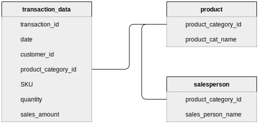

# Interactive Dashboard with Tableau

# Introduction

A dashboard is a visual representation of data that provides a consolidated view of key information and metrics in a single interface. It typically consists of various charts, graphs, tables, and other data visualization elements that allow users to monitor and analyze data trends, performance indicators, and important metrics relevant to a specific domain or business process. 

Tableau is a widely used data visualization and business intelligence tool that helps people see and understand their data. It provides an intuitive and interactive platform for creating visually appealing and interactive dashboards, reports, and charts.

Tableau allows users to connect to various data sources, such as databases, spreadsheets, cloud services, and more, and then transform the data into interactive visualizations using a drag-and-drop interface. It offers a wide range of visualization options, including bar charts, line graphs, scatter plots, maps, and more, which can be customized and combined to create compelling dashboards.

In Tableau, there are two primary types of connections we can establish with our data sources: live connection and extract connection.

## 1. Live Connection

With a live connection, Tableau directly connects to the data source in real-time whenever a query or interaction is made with the visualization. It retrieves the data dynamically from the source, allowing us to work with the most up-to-date information available. Live connections are useful when we need to analyze real-time data or when our dataset is frequently updated, and we want to ensure we are always working with the latest data. However, live connections can be slower if the data source is large, or the network connection is slow.

## 2. Extract Connection

An extract connection involves importing a subset or the entire dataset from the data source into Tableau's proprietary data format, known as a data extract (.hyper file). Tableau extracts store a snapshot of the data at the time of creation and can be refreshed periodically to reflect changes in the source data. Extracts are particularly useful when working with data that doesn't change frequently or when we want to perform complex calculations or aggregations that can be pre-computed and stored in the extract.

# MegaMarts Sales Dashboard

MegaMarts is a store which sells various goods to consumers all over the world. The company works only through Sales Agents who are responsible for selling products to their customers. The sales agents are responsible for the sales of products in specific product categories.

## Requirements

1. Sales for the agent every month
2. A scatterplot showing quantity by sales for each product categories.
3. Top 5 product categories by sales of the selected month
4. Parameter to set sales target and see how the sales agent is tracking.

## Data Source

[ 1. transaction_data.csv ](https://raw.githubusercontent.com/Ashmin-Bhattarai/MegaMart-Sales-Dashboard/main/data/transaction_data.csv)

[ 2. salesperson.csv ](https://raw.githubusercontent.com/Ashmin-Bhattarai/MegaMart-Sales-Dashboard/main/data/salesperson.csv)

[3. product.csv](https://raw.githubusercontent.com/Ashmin-Bhattarai/MegaMart-Sales-Dashboard/main/data/product.csv)

## Data Model

# Importing Data on Tableau

All the mentioned data are in csv files hence, we can import csv files directly on tableau. Since, we are working with periodically updating data, it is best to select ‘extract connection’ type and save data snapshot at desired location.

# Joining Tables

Since, we have total three tables as shown in the ER diagram above. we need to create joins in tableau as well. 

# Creating Worksheet

For each card on dashboard, individual sheet has to be created. Each sheet will contains single chart, graph, test card or a table.

## Sales for Month

## Sales per Category

## Sales vs Quantity Scatterplot

## Details of Transaction

# Dashboard to visualize all charts

 

This is the final dashboard where all created sheets are organized in a single layout. Similarly, in the right side of chart there are some filters we can apply to get specific details. 

Furthermore, this dashboard also has drilldown feature, where we can see detail transaction data. To drilldown into the data, click on specific point where we want to see the data. 

Click on ‘Click for more details.’  Then we can see detail information of that point in chart. Here, I have selected Sales of September month so, the drilldown table will show all the sales transaction happen on September month.

This dashboard is published on tableau public.

[MegaMart Sales Agent Dashboard](https://public.tableau.com/views/MegaMartSalesAgentDashboard_16858743265590/Dashboard?:language=en-US&publish=yes&:display_count=n&:origin=viz_share_link)
